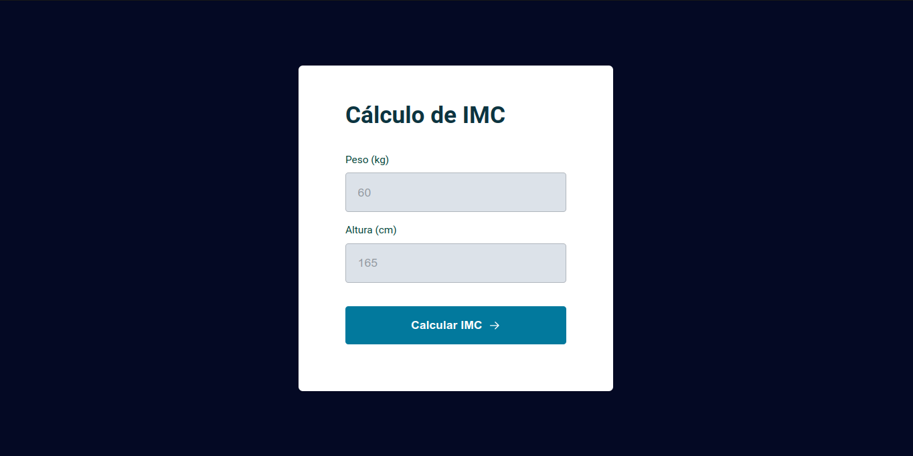

# 👨🏻‍💻 BMI Calculator

Welcome to the BMI Calculator, a simple tool to calculate Body Mass Index (BMI). This project uses HTML, CSS, and JavaScript to create an interactive experience.

## 🧮 How to Use

1. Open the `index.html` file in your web browser.
2. Enter your weight in kilograms and height in centimeters.
3. Click the "Calculate BMI" button to see your BMI result.
4. A modal will display your BMI, and you can close it.

## 🚀 Technologies Used

- **HTML:** Basic page structure.
- **CSS:** Styling for a user-friendly interface.
- **JavaScript (ES6+):** Interactive functionality of the BMI calculator.

## 🖥️ Project Preview

## 📜 License

This project is distributed under the MIT License.
